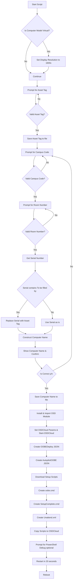

```mermaid
flowchart TD
    A[Start Script] --> B{Is Computer Model Virtual?}
    B -- Yes --> C[Set Display Resolution to 1600x]
    B -- No --> D[Continue]
    C --> D
    D --> E[Prompt for Asset Tag]
    E --> F{Valid Asset Tag?}
    F -- No --> E
    F -- Yes --> G[Save Asset Tag to file]
    G --> H[Prompt for Campus Code]
    H --> I{Valid Campus Code?}
    I -- No --> H
    I -- Yes --> J[Prompt for Room Number]
    J --> K{Valid Room Number?}
    K -- No --> J
    K -- Yes --> L[Get Serial Number]
    L --> M{Serial contains To be filled by}
    M -- Yes --> N[Replace Serial with Asset Tag]
    M -- No --> O[Use Serial as is]
    N --> P[Construct Computer Name]
    O --> P
    P --> Q[Show Computer Name & Confirm]
    Q --> R{Is Correct y/n}
    R -- No --> H
    R -- Yes --> S[Save Computer Name to file]
    S --> T[Install & Import OSD Module]
    T --> U[Set OSDCloud Params & Start-OSDCloud]
    U --> V[Create OOBEDeploy JSON]
    V --> W[Create AutopilotOOBE JSON]
    W --> X[Download Setup Scripts]
    X --> Y[Create oobe.cmd]
    Y --> Z[Create SetupComplete.cmd]
    Z --> AA[Create Unattend.xml]
    AA --> AB[Copy Scripts to OSDCloud]
    AB --> AC[Prompt for PowerShell Debug optional]
    AC --> AD[Restart in 20 seconds]
    AD --> AE[Reboot]
```