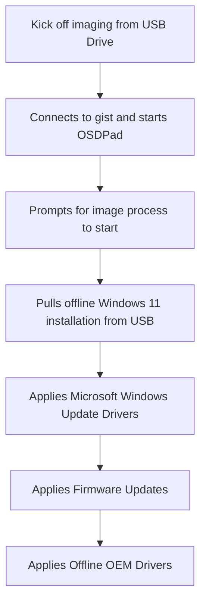

```mermaid
flowchart TD
    A[Kick off imaging from USB Drive] --> B[Connects to gist and starts OSDPad]
    B --> C[Prompts for image process to start]
    C --> D[Pulls offline Windows 11 installation from USB]
    D --> E[Applies Microsoft Windows Update Drivers]
    E --> F[Applies Firmware Updates]
    F --> G[Applies Offline OEM Drivers]
```